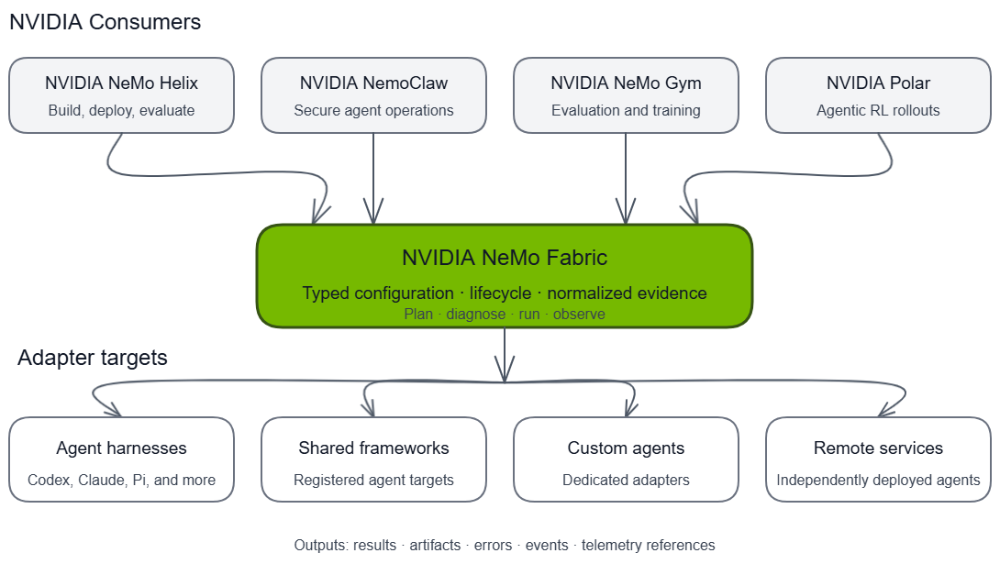

{/* SPDX-FileCopyrightText: Copyright (c) 2026, NVIDIA CORPORATION & AFFILIATES. All rights reserved.
SPDX-License-Identifier: Apache-2.0 */}

NVIDIA NeMo Fabric connects products that build, deploy, evaluate, and improve agents to a growing set of agent harnesses and custom agents. Each consumer keeps ownership of its product workflow while NeMo Fabric provides a common execution boundary for configuration, lifecycle, results, artifacts, and telemetry.

## Integration Status

The ecosystem includes integrations at different maturity levels:

| Consumer | Status | How It Uses NeMo Fabric |
| --- | --- | --- |
| [NVIDIA NeMo Helix](https://github.com/NVIDIA-NeMo/nemo-helix) | Available | Runs and evaluates platform-managed agents through lifecycles backed by NeMo Fabric. |
| [NVIDIA NemoClaw](https://github.com/NVIDIA/NemoClaw/) | Active integration | Uses NeMo Fabric inside NVIDIA OpenShell sandboxes to run supported harnesses. |
| [NVIDIA NeMo Gym](https://github.com/NVIDIA-NeMo/gym) | Reference integration | Demonstrates NeMo Fabric harnesses as agents for evaluation and training environments. |
| [NVIDIA Polar](https://github.com/NVIDIA-NeMo/ProRL-Agent-Server) | Emerging | Can use NeMo Fabric as a portable harness boundary for agentic reinforcement learning rollouts. |

## NVIDIA NeMo Helix

[NVIDIA NeMo Helix](https://github.com/NVIDIA-NeMo/nemo-helix) is a platform for building, deploying, evaluating, and improving agents. Its platform-managed agent path translates durable agent definitions into NeMo Fabric configuration. NeMo Fabric then runs the selected harness while NeMo Helix manages deployment, shared model infrastructure, evaluation, and the broader product lifecycle.

For more information about NeMo Helix, refer to the [NeMo Helix documentation](https://docs.nvidia.com/nemo-helix/documentation/home/).

This integration demonstrates that a platform can support multiple harnesses without embedding each harness lifecycle into its core services. Refer to [NeMo Studio Agents](https://docs.nvidia.com/nemo-helix/latest/documentation/studio/agents/) and [Evaluate with a NeMo Fabric Harness](https://docs.nvidia.com/nemo-helix/documentation/evaluate-models/agent-eval/fabric-runner/) for the shipped workflows.

## NVIDIA NemoClaw

[NVIDIA NemoClaw](https://github.com/NVIDIA/NemoClaw/) is an open-source reference stack for operating agents in secure NVIDIA OpenShell sandboxes. The active integration uses NeMo Fabric as the in-sandbox execution layer while NemoClaw owns sandbox provisioning, policy, deployment, and recovery.

For more information about NemoClaw, refer to the [NemoClaw documentation](https://docs.nvidia.com/nemoclaw/latest/about/overview.html).

This boundary lets NemoClaw offer multiple harnesses through one lifecycle and evidence contract without moving sandbox ownership into NeMo Fabric. The integration is still being hardened for release compatibility, conformance, and downstream validation.

## NVIDIA NeMo Gym

[NVIDIA NeMo Gym](https://github.com/NVIDIA-NeMo/gym) provides environments for evaluating and improving models and agents at scale. Its NeMo Fabric agent integration runs supported harnesses behind Gym's agent-server boundary, allowing the same environments and verifiers to compare harnesses or collect rollouts without changing the task contract.

NeMo Gym continues to own environments, tasks, verifiers, concurrency, and training integration. NeMo Fabric owns harness configuration and execution and returns normalized results and evidence.

## NVIDIA Polar

[NVIDIA Polar](https://github.com/NVIDIA-NeMo/ProRL-Agent-Server) is a rollout framework for real-world agent harnesses. A NeMo Fabric integration is an emerging direction rather than a shipped capability. The intended boundary would let Polar select a harness backed by NeMo Fabric while retaining ownership of rollout scheduling, runtime pooling, trajectory construction, evaluation, and trainer integration.

This direction would give reinforcement learning systems the same portable harness contract used by application and evaluation consumers.

## Build a Consumer Integration

Consumer integrations use the public NeMo Fabric Python SDK to construct `FabricConfig`, plan capabilities, manage runtimes, and consume normalized results and artifacts. Refer to the [consumer integration overview](../integrations/consumer/overview.mdx) and [Python SDK guide](../sdk/python.mdx) to build another integration through the same boundary.
